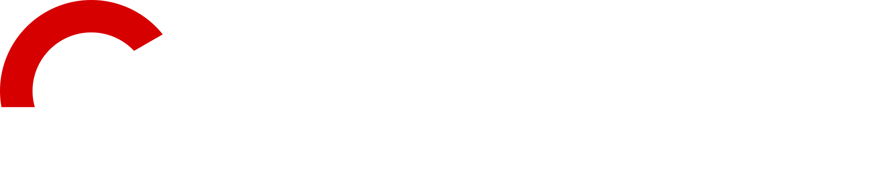

<!-- TODO: make Banner -->


<h1>
  
  - Manage your Pokémon SoulLink challenge with your partner
</h1>


> A modern Progressive Web App (PWA) built with only "VanillaJs" and WebComponents.  
> Track team status, progress, and rules in authentic Gen 5 style.

<!-- [](YOUR_DEMO_URL) -->
<!-- [](LICENSE) -->
<!-- []() -->
[]()
[]()
[]()

<!-- toc:start -->

- [📱 About](#-about)
  - [Features](#features)
- [🖼️ Screenshots](#️-screenshots)
- [🛠️ Tech Stack](#️-tech-stack)
- [📂 Project Structure](#-project-structure)
- [🚀 Getting Started](#-getting-started)
  - [Prerequisites](#prerequisites)
  - [Installation](#installation)
  - [Development](#development)
    - [Start everything](#start-everything)
      - [Linux](#linux)
      - [macOS/Windows](#macoswindows)
      - [Running Everything](#running-everything)
      - [Running Nginx only](#running-nginx-only)
    - [Browser size](#browser-size)
    - [Safari](#safari)
- [🗺️ Roadmap](#️-roadmap)
- [👤 Authors](#-authors)
  - [Marc](#marc)
  - [Tim](#tim)
- [⭐ Support](#-support)

<!-- toc:end -->

## 📱 About

**PokéSync** is a Progressive Web App designed to help with Pokémon SoulLink Runs.
<!-- TODO: more and better description -->

It provides a fast and installable experience across desktop and mobile devices.

### Features

- **Installable** — Can be installed like a native app
- **Offline Support** — Works without an internet connection
- **Automatic Updates** — Keeps the app up to date
- **Private** — Runs entirely client-side with no server to phone home to. Your data stays on your device.
- **Classic UI** — Clean and accessible interface styled in homage to the 5th Generation.

## 🖼️ Screenshots

<!-- TODO: make Screenshots -->
| Desktop                                          | Mobile                                         |
| ------------------------------------------------ | ---------------------------------------------- |
|  |  |

<!-- ## 🌐 Live Demo
TODO: URL
👉 **[Try the PWA](YOUR_DEMO_URL)** -->

## 🛠️ Tech Stack

- **Frontend:** Vanilla JS with WebComponents
- **Styling:** CSS
- **PWA:** Service Worker + Web App Manifest
- **Build Tool:** -
- **Backend:** - (Any Webserver)
- **Database:** LocalStorage and 3rd party Pokémon sprite resources

## 📂 Project Structure

```text
PokeSync/
├── assets/...
│
├── src/
│   ├── components/
│   ├── pages/
│   └── ... utils
│
├── screenshots/
│   ├── desktop.png
│   └── mobile.png
│
├── ideation/
│   ├── PokéSync Jam.jam
│   └── PokéSync.fig
│
├── test-server/
│   ├── browsers/...
│   ├── compose.yml
│   └── nginx.conf
│
├── .gitignore
├── index.html
├── index.mjs
├── style.css
├── site.webmanifest
├── pokedex.json
├── README.md
├── ...
└── LICENSE
```

## 🚀 Getting Started

### Prerequisites

Make sure you have installed:

- Docker or Podman
- Git

### Installation

Clone the repository:

```sh
git clone https://github.com/Mangonssen/PokeSync.git
```

Navigate into the project:

```sh
cd PokeSync
```

### Development

Simple Podman setup for serving PokeSync with Nginx and testing it in Firefox, Chrome, and WebKit.

#### Start everything

##### Linux

Install Podman using your distribution's package manager, then:

```sh
cd test-server
podman compose up --build
```

##### macOS/Windows

Start the Podman machine first if not already:

```sh
podman machine start
```

or via Podman Desktop.

Then:

```sh
cd test-server
podman compose up --build
```

##### Running Everything

From `test-server/`:

```sh
podman compose up --build
```

Then open:

- Website: <http://localhost:8080>
- noVNC: <http://localhost:6080/vnc.html>
- VNC: `localhost:5900`

The browser container opens the site in Firefox, Chrome, and Playwright WebKit.

The internal hostname is:

```url
http://pokesync/
```

##### Running Nginx only

To only run the web server:

```sh
podman compose up nginx
```

Then open:

```url
http://localhost:8080
```

#### Browser size

The browser viewport can be configured with:

```dockerfile
environment:
  WEB_WIDTH: "390"
  WEB_HEIGHT: "844"
  IS_MOBILE: "true"
```

The virtual VNC screen can be configured separately:

```dockerfile
environment:
  SCREEN_WIDTH: "1280"
  SCREEN_HEIGHT: "900"
```

#### Safari

The WebKit browser is **not Apple's Safari**. It uses Playwright's WebKit engine.

For actual Safari testing, Safari itself must be used on macOS/iOS or through a browser-testing service.

<!-- ### Production Build

TODO: write -->

## 🗺️ Roadmap

<!-- TODO: write -->
- [ ] write a roadmap
<!-- - [ ] Initial PWA setup
- [ ] Web App Manifest
- [ ] Service Worker
- [ ] Background sync
- [ ] Improved offline support
- [ ] App shortcuts
- [ ] iOS optimization -->

<!-- ## 📄 License

TODO: write -->

## 👤 Authors

### Marc

<!-- - GitHub: @YOUR\_USERNAME
- Website: yourwebsite.com -->

### Tim

<!-- - GitHub: @YOUR\_USERNAME
- Website: yourwebsite.com -->

## ⭐ Support

 If you found this project useful, consider giving it a ⭐ on GitHub!

---

<p align="center"\> Made with ❤️ using modern web technologies by Marc and Tim</p>
